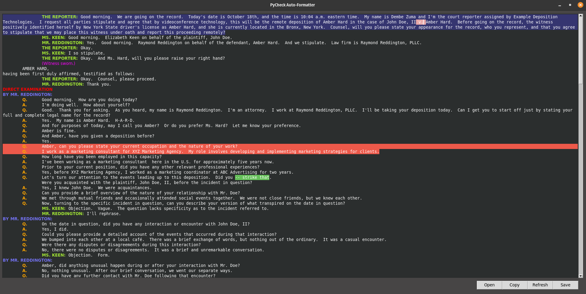

# PyCheck

[](./LICENSE)


## Introduction

This is PyCheck! A legal transcript auto-formatter and checklist, inspired by [_Automate the Boring Stuff with Python_](https://automatetheboringstuff.com/) by Al Sweigart and [_Formation_](https://github.com/ObaraEmmanuel/Formation) library by [@ObaraEmmanuel](https://github.com/ObaraEmmanuel).



## Motivation

I have been proofreading legal transcripts manually (~500 pages weekly on average), following specific guidelines. The development of this tool aims to achieve the following:

* **Accuracy**: Ensure all formatting guidelines are applied correctly, such as adding a colon and two spaces after all speaker IDs in Colloquy and a tab after all Q&As.

* **Consistency**: Common words like `videoconference` should be spelled as such throughout the document.

* **One-Click functionality**: Merge and format the document(s) in one click.

* **Ease & Speed**: Simplify the time-consuming and tedious process of manual formatting, reducing it to mere _seconds_.

The use of `PyCheck` has improved my review scores to [100%](./images/results.png).

For a raw sample transcript, see [sample.txt](/sample.txt) and for a PyCheck-formatted document, see [final.txt](/docs/final.txt).  

## 🚀 Quick Start

### 1. Clone the repository

```bash
git clone https://github.com/ArshavineRoy/pycheck
cd pycheck
```

### 2. Create and activate a virtual environment

* To use `virtualenv`:

    ```bash
    virtualenv venv
    ```

* Activation

    ```bash
    # macOS and Linux

    source venv/bin/activate

    # Windows

    venv\Scripts\activate
    ```

### 3. Install required dependencies

```bash
pip install -r requirements.txt
```

### 4. Run PyCheck

```bash
python app.py
```

### 5. Click `Open` and load raw `sample.txt` in the project's root folder

> `sample.txt` in its entirety is a `FULLY FICTIONAL deposition transcipt` that serves as a file you might have to proofread, with deliberate mistakes included to demonstrate the power of PyCheck!

## 📖 Usage

PyCheck has the following perks out of the box:

* Text color for different scenarios to easily differentiate between **examination headings, by-lines, Colloquy, QA, and parentheticals**.

* Highlights any inconsistencies in QA examinations. This way, you won't have any Qs following each other. The order should be **Q-A-Q-A-Q-A** not **Q-Q-Q-A-Q-A**.

* Edit to fix any mistakes in-app, save as a new file or copy-paste when done.

* A `refresh` button to re-run the checklist instead of loading the file every time.  

* Highlights and formats all instances of `strike that`, _just in case_.

    > When an attorney says, "Strike that," the statement that follows MUST start on a new line.

* Highlights the beginning of different files, in case you're loading several parts.

    > To demonstrate, duplicate sample.txt and select both files when uploading. **Note:** The files are alphabetically ordered.

## Miscellaneous

Let's go over some legal jargon:

* **Q&A Examination:** this is when a witness is being questioned. The questioning is usually done by an
attorney, but it is sometimes done by an investigator on behalf of an insurance company, a
detective, etc. [During testimony, "Q" is the examining attorney and "A" is the witness](https://1word1day.livejournal.com/438152.html).

    > RULE:  Q. and A. (with periods) should be used with a tab before and after and wrap to the left margin.

    ```text
    |   Q.  Did you sustain any injuries in that collision?
    |   A.  That’s when I broke my left wrist.
    ```

* **Colloguy:** any dialogue that is not part of an examination and, as such, occurs outside of the
present line of questioning, e.g., when an attorney speaks to the court reporter.

    [In colloquy, the witness is referred to simply as "THE WITNESS," with other participants in the conversation being referred to as MR. or MS. followed by their last name.](https://1word1day.livejournal.com/438152.html)

    > RULE:  Colloquy should have two tabs prior to each speaker ID, followed by a colon, and then 2 spaces.  The text should wrap to the left margin.

    ```text
    |       MR. REDDINGTON:  I have no further questions for the witness at this time.
    |       MS. KEEN:  Can we take a break before I begin my cross?
    |       MR. REDDINGTON:  Sure thing.
    |       THE REPORTER:  The time is 11:02 a.m., and we are off the record.    
    ```

* **By-Lines:** indicate which speaker speaker the Q represents in Q&A examinations. They are used at the beginning of examinations and when you break from Colloquy back into Q/A and MUST end with a colon.

* **Parentheticals:** e.g., (Off the record.) are [used to describe something that is vital to the proceedings but not necessarily said out loud. These can be all sorts of things, including when a break was taken or when an exhibit was marked.](https://stenonymous.com/2017/09/05/where-what-parenthetical/#:~:text=So%20you%20might%20have%20heard,when%20an%20exhibit%20was%20marked.)

    > RULE: Parentheticals should be on a line by themselves, preceded by two tabs.

    ```text
    |       THE REPORTER:  The time is 11:02 a.m., and we are off the record.
    |       (Off the record.)
    |       THE REPORTER: We are back on the record. The time is 11:05 a.m.  
    ```

## Author & License

Author - [Arshavine Waema](https://github.com/ArshavineRoy).

Licensed under the [MIT License](LICENSE) - see the [LICENSE](LICENSE) file for details.
